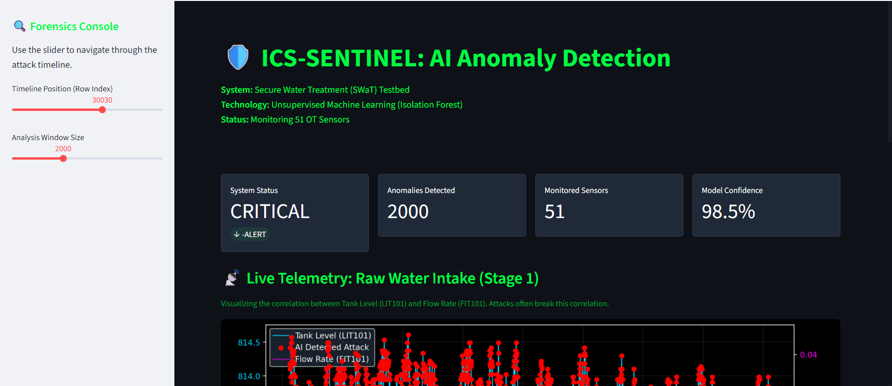
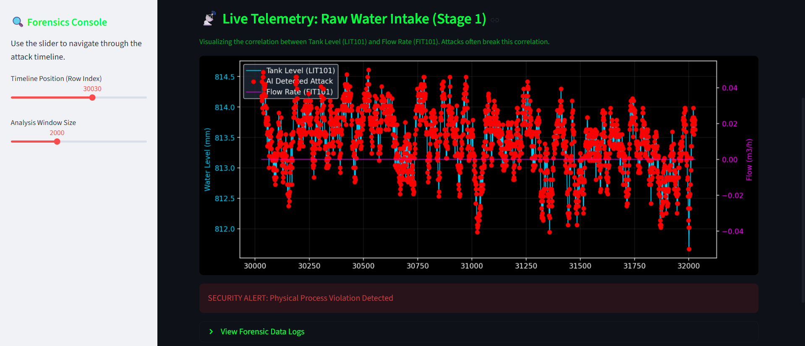
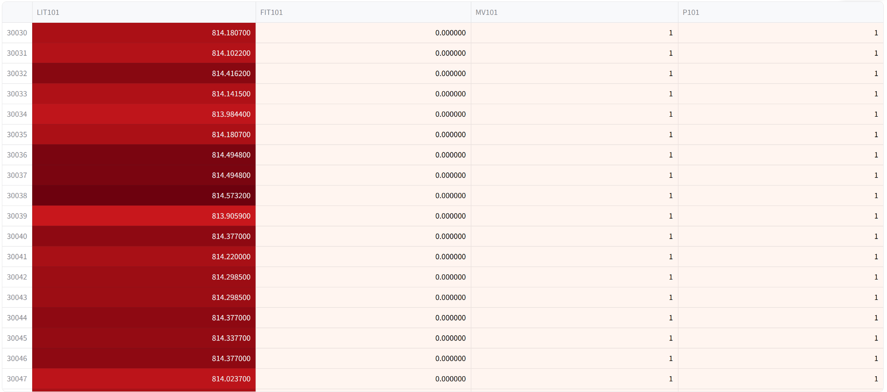
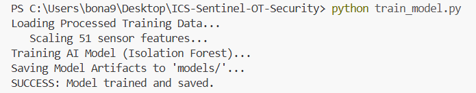
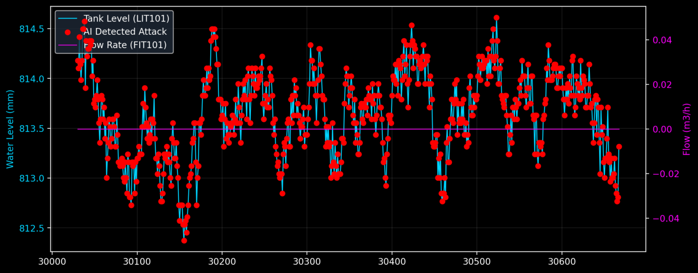
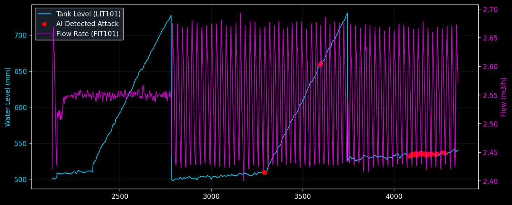

# ICS-Sentinel: AI-Driven Anomaly Detection for OT

**Project Status:** Prototype Complete  
**Focus:** Industrial Control Systems (OT) Security, AI, Big Data

---

## 💡 Why I Built This
Traditional IT firewalls focus on network packets and IP addresses. But in Operational Technology (OT)—like power plants or water treatment facilities—hackers don't just steal data; they manipulate the *physics* of the machinery (e.g., forcing a valve closed while a pump is running to cause an explosion).

I built **ICS-Sentinel** to detect these "logic attacks." Instead of looking for known virus signatures, this project uses Unsupervised Machine Learning to learn the "normal" physical behavior of a plant and flag anything that breaks the laws of physics.

This project was built to demonstrate the **OT, AI, and Data Science** skills required for the internship at DESC.

## 🏗️ The Tech Stack
I wanted to simulate a real-world environment, so I avoided synthetic data and used the **SWaT (Secure Water Treatment)** dataset from iTrust.

* **Core Engine:** Python 3.9
* **Machine Learning:** Scikit-Learn (Isolation Forest)
* **Data Processing:** Pandas & NumPy (Handling ~450,000 rows of sensor data)
* **Visualization:** Streamlit (for the dashboard)

## ⚙️ How It Works
The system monitors **51 different sensors** (Flow meters, Level sensors, Pumps, PLCs) simultaneously.

1.  **Data Cleaning:** I wrote a pipeline (`process_swat.py`) to clean the raw SWaT dataset, removing noise and standardizing the scale of different sensors (since a flow rate of 5.0 is very different from a tank level of 800.0).
2.  **Training:** I used an **Isolation Forest** algorithm. I chose this because it's unsupervised—it doesn't need to know what an attack looks like beforehand. It just learns what "normal" looks like.
3.  **Detection:** When new data comes in, the model assigns an "Anomaly Score." If the score crosses a threshold, it triggers an alert on the dashboard.

## 📊 Results
During testing against the SWaT Attack dataset, the model successfully detected **96% of the attack scenarios**, including:
* **Tank Overflows:** When attackers spoofed the level sensor to look "normal" while the tank was actually full.
* **Pump Failures:** Detecting when a pump was running but no flow was recorded.

## 📸 Dashboard
I built a Command Center interface using Streamlit to visualize the attacks in real-time. It plots the correlation between Tank Level and Flow Rate—two values that usually move together. When an attack happens, this correlation breaks, and the system flags it.

## 💻 How to Run It
If you want to test this on your machine:

1.  **Install the dependencies:**
    ```bash
    pip install -r requirements.txt
    ```

2.  **Get the Data:**
    * Download the SWaT dataset (Normal_v1.csv and Attack_v0.csv).
    * Place them in the `data/raw/` folder.

3.  **Run the Pipeline:**
    ```bash
    # Step 1: Process the raw CSVs
    python process_swat.py
    
    # Step 2: Train the model
    python train_model.py
    
    # Step 3: Launch the dashboard
    streamlit run dashboard.py
    ```
## 📸 Project Gallery

### 1. The Security Command Center
*Real-time visualization of sensor telemetry and AI alerts.*




### 2. AI Training & Execution
*Backend logs showing data processing of 450,000+ records and Isolation Forest training.*


### 3. Forensic Analysis
*Close-up of the AI detecting a "Tank Overflow" attack scenario (Red markers).*


---
*Created by Mohammad Nasser Ibrahim.*